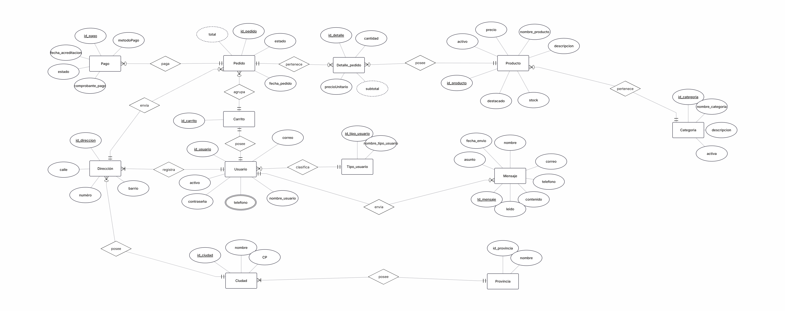

# Diagrama Entidad-Relación (DER)

El Diagrama Entidad-Relación representa el modelado conceptual de la base de datos del sistema.

En el DER se identifican las principales entidades del sistema (representadas en rectángulos), sus atributos (representados en óvalos, distinguiendo sus claves primarias subrayadas, atributos multivaluados con doble línea y atributos derivados con línea punteada) y las relaciones que las vinculan (representadas en rombos) junto con sus cardinalidades.

El modelo fue realizado utilizando la **notación de Peter Chen en ERDPlus**.

La imagen correspondiente al diagrama se encuentra en: 
